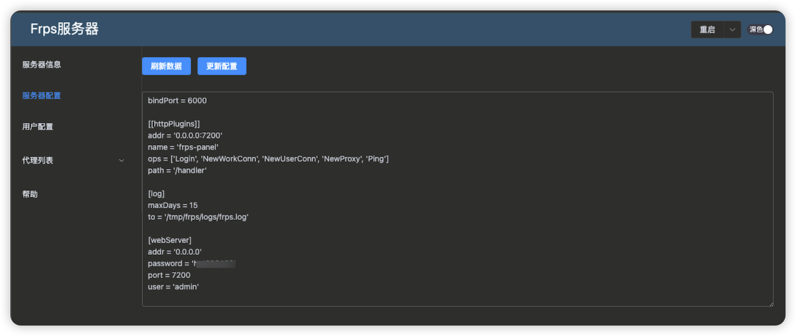

<div align="center">
  
  <h1 align="center">go-frp-panel</h1>
</div>

<div align="center">基于Frp开源代码打造的自定义配置管理📺，无需配置文件，自定义配置，在线自动升级，免去了配置文件的复杂操作，可实现『✨秒妙极安装体验🚀』</div>
<br>
<p align="center">
  <a href="https://github.com/xxl6097/go-frp-panel/releases/latest">
    
  </a>
  <a href="https://github.com/xxl6097/go-frp-panel/releases/latest">
    
  </a>
  <a href="https://github.com/xxl6097/go-frp-panel/fork">
    
  </a>
</p>


- [✅ 特点](#特点)
- [⚙️ 配置参数](#配置)
- [🚀 快速上手](#快速上手)
    - [Frps安装](#Frps服务端程序安装)
    - [Frpc客户端程序安装](#Frpc客户端程序安装)
    - [服务端界面](#frps主界面)
    - [客户端界面](#frpc主界面)
- [❤️ 赞赏](#赞赏)
- [👀 关注(更新订阅+答疑交流)](#关注)
- [📣 免责声明](#免责声明)
- [⚖️ 许可证](#许可证)

📍订阅源来自：

- [fatedier/frp](https://github.com/fatedier/frp)
## 特点

- ✅ 程序以服务形式安装并运行，支持跨平台windows、linux、macos平台；
- ✅ 新增重启功能，用户可管理后台操作重启；
- ✅ 新增在线升级功能，可上传式升级和文件url式升级；
- ✅ 新增可在管理后台端查看日志功能；
- ✅ frps服务端可生成frpc客户端，密钥信息二进制内嵌在客户端程序中；
- ✅ 新增用户配置，可以配置授权用户供frpc端使用
- ✅ frpc客户端可运行多客户端
- ✨ 新增frpc用户配置导入导出

## 快速上手

### Frps服务端程序安装


#### 命令行

```shell
root@clife-fnos:~/files# chmod +x acfrps_0.5.44_linux_amd64 
root@clife-fnos:~/files# ./acfrps_0.5.44_linux_amd64 install

请输入Frps服务器绑定端口：6000
请输入管理后台端口：7200
请输入管理后台地址(默认0.0.0.0)：
请输入管理后台用户名(admin)：admin
请输入管理后台密码：xxxxx
```

#### frps主界面：

<div align="center">
  
</div>

升级界面：
<div align="center">
  
</div>

配置界面：
<div align="center">
  
</div>

用户界面：
<div align="center">
  
</div>

### Frpc客户端程序安装

首先在服务器端新增账户，然后生成客户端（需先在frps端上传客户端），如下图：
生成客户端界面：
<div align="center">
  
</div>

如上如，生成客户端后，上传到电脑端运行，命令如下：

```shell
root@clife-fnos:~/files# chmod +x acfrpc_0.5.48_linux_amd64 
root@clife-fnos:~/files# ./acfrpc_0.5.48_linux_amd64 install
App Name:       acfrpc
App Version:    0.5.48
Build version:  v0.5.48
Build time:     2025-02-27 Thursday 17:21:35
Git revision:   059ac51
Git branch:     tags/v0.5.47^0
Golang Version: go version go1.23.2 darwin/arm64
DisplayName:    AcFrpc网络代理程序_v0.5.48
Description:    一款基于GO语言的网络代理服务程序

请输入管理后台端口：6400
请输入管理后台用户名：admin
请输入管理后台密码：xxxxxxx
```

##### frpc主界面：

<div align="center">
  
</div>

frpc创建多客户端：

<div align="center">
  
</div>

## 赞赏

<div>开发维护不易，请我喝杯咖啡☕️吧~</div>

| 支付宝                                  | 微信                                     |
|--------------------------------------|----------------------------------------|
|  |  |

## 关注

## 免责声明

本项目仅供学习交流用途，核心功能来源于[fatedier/frp](https://github.com/fatedier/frp)，如有侵权，请联系删除

## 许可证

[MIT](./LICENSE) License &copy; 2024-PRESENT [xxl6097](https://github.com/xxl6097)
